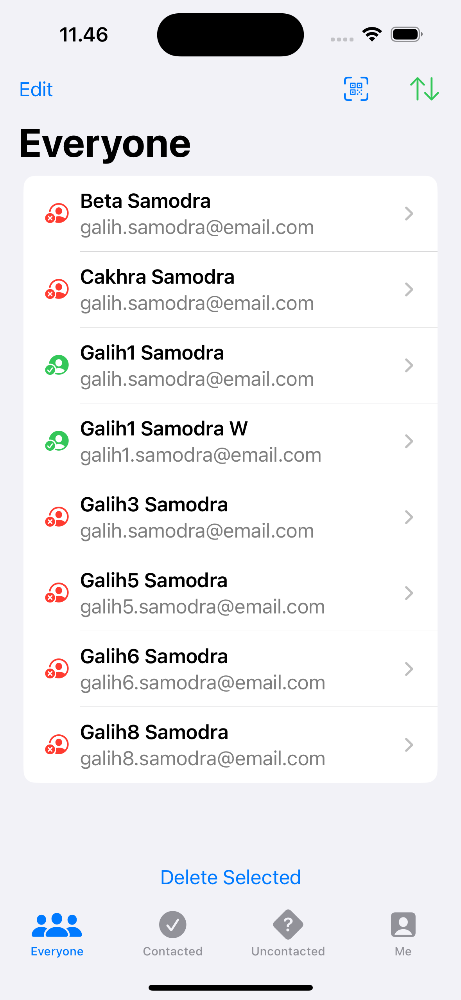
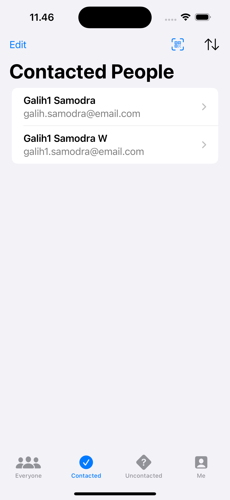
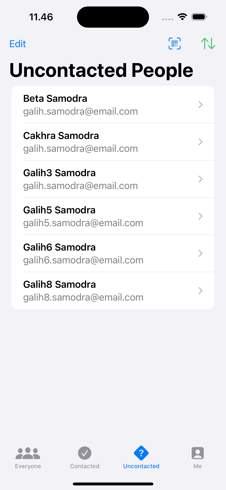
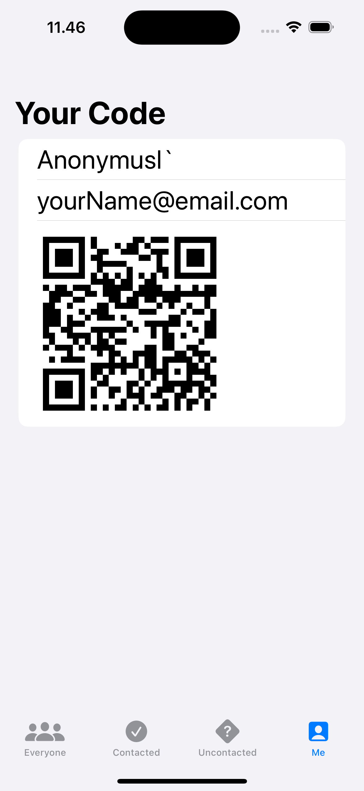
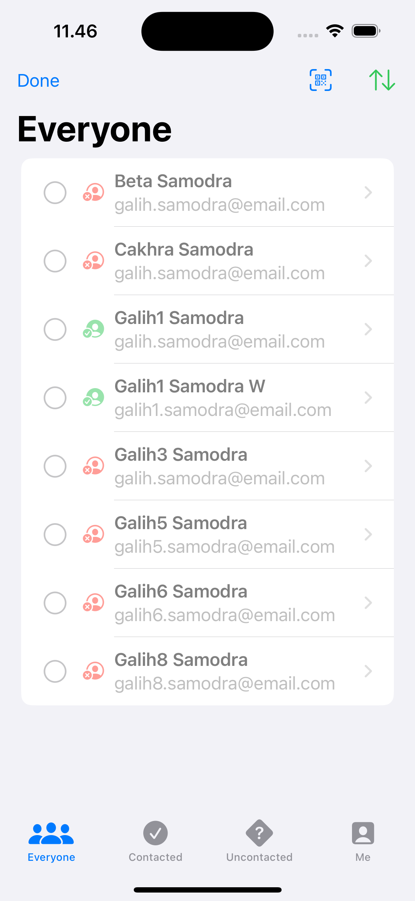
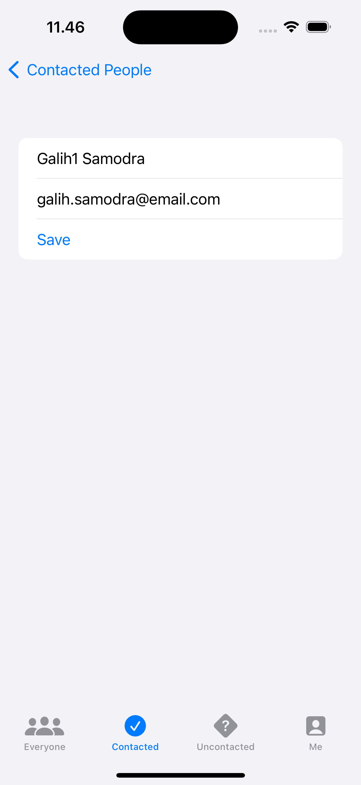

# Hot-Prospects
This is a basic learning project to create an app for tracking people you meet at conferences. The app allows users to share their attendee information using a QR code, scan others’ codes to build a list of leads, and organize contacts into categories for follow-up. The app is divided into four tabs, each providing a distinct view and functionality for managing leads.

---  
The source learning is from the 16th project of the course "100 Days of SwiftUI" (https://www.hackingwithswift.com/100/swiftui)  

---  
## Goals  
1. Display a tab bar with four sections:  
   - **Everyone**: Shows a list of all contacts, indicating whether they are contacted or uncontacted.  
   - **Contacted**: Displays a list of people you have already contacted.  
   - **Uncontacted**: Displays a list of people you have yet to contact.  
   - **Me**: Shows the user's name, email, and QR code for sharing their attendee information.  

2. Allow users to tap on any contact in the "Everyone," "Contacted," or "Uncontacted" tabs to view detailed information.  

3. Provide toolbar buttons in the "Everyone," "Contacted," and "Uncontacted" tabs to:  
   - Edit the contact list.  
   - Scan QR codes to add new contacts.  
   - Sort the list for better organization.  

4. Enable the user to view and share their QR code in the "Me" tab for easy contact sharing.  

5. Ensure a seamless user experience for managing contacts across all tabs.

# Hot-Prospects – Image Comments Feature

---

